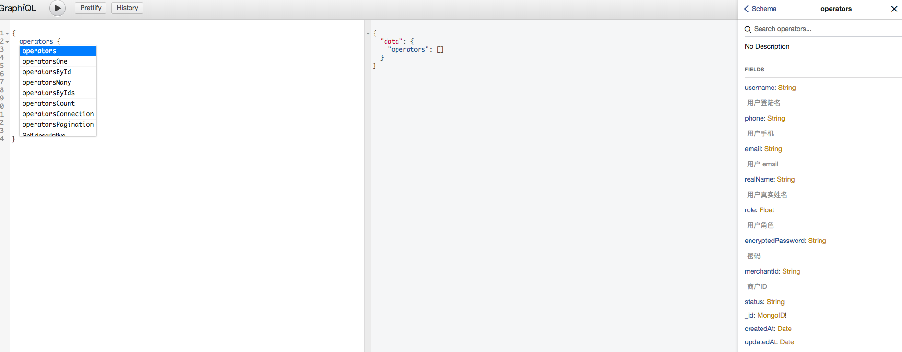

# irajs-graphql
快速在 koa + mongoose 架构里，使用 graphQL。
主要整合了 `graphql-compose` 与 `graphql-compose-mongoose`, 快速生成 graphQL schema。

## 提示
当前版本 v0.1.0，不宜用于生产环境。更多用于实验与探索。

## 亮点
 - 快速搭建 graphql 服务, 并不需要犹豫与编写过多的代码。（请看示例）
 - 可能是一个小团队里，作为公共 Data 服务的一个解决方案。只需要一人用兼职时间就能维护 DATA 服务。
 - 借力 graphiql, 不用写 api 文档， 不用写 api 文档，不用写 api 文档。
 
## 运行 example
安装 `npm i`
运行 `npm run example`

访问 http://localhost:11301/api/v1/graphiql, 可以看到 graphiql 操作界面

## TODO
- [] 编写 test
- [] 发布 npm package
- [] 编写更好的文档
- [] 封装易用的客户端
- [] 优化后端取数

## LICENSE
MIT